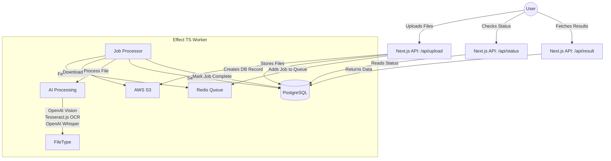

# AI Media Processing Pipeline

A Next.js & Effect powered AI pipeline that uploads, processes, and extracts metadata from images and PDFs using OpenAI, Tesseract.js, and AWS S3—fully async with Redis queue & Postgres storage.

## Architecture



## Tech Stack

| Tech          | Purpose                   |
| ------------- | ------------------------- |
| Bun           | Runtime                   |
| Next.js 15    | Frontend                  |
| Tailwind v4   | Styling                   |
| Effect TS     | Async processing pipeline |
| AWS S3        | Object storage            |
| Neon          | Postgres DB               |
| Redis         | Caching & job queue       |
| OpenAI Vision | Image analysis            |
| Tesseract.js  | PDF OCR                   |

## Getting Started

1. Install dependencies:

```bash
bun install
```

2. Set up environment variables:

```bash
cp .env.example .env
```

3. Run the development server:

```bash
bun dev
```

Open [http://localhost:3000](http://localhost:3000) to view the application.

## Environment Setup

Required environment variables:

```bash
# Database
DATABASE_URL=

# Redis
REDIS_URL=

# AWS
AWS_ACCESS_KEY_ID=
AWS_SECRET_ACCESS_KEY=
AWS_REGION=
S3_BUCKET_NAME=

# OpenAI
OPENAI_API_KEY=
```

## API Routes

- `POST /api/upload` - Upload files
- `GET /api/status/:jobId` - Check processing status
- `GET /api/result/:jobId` - Retrieve processing results

## Development

```bash
# Run development server
bun dev

# Run tests
bun test

# Run type checking
bun type-check

# Run linting
bun lint
```

## Deployment

The application is designed to be deployed on Vercel with the following services:

| Provider | Service      |
| -------- | ------------ |
| Vercel   | Frontend     |
| Neon     | Postgres     |
| Upstash  | Redis        |
| AWS S3   | File Storage |

## License

MIT
